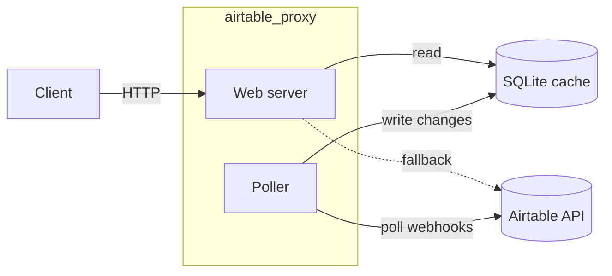

# airtable_proxy

This is intended to be a lightweight proxy for the Airtable API which trades data freshness for higher speeds. It uses [webhooks](https://airtable.com/developers/web/api/model/webhooks-payload) to tail all changes to a base's records and update a local cache. As a result, it is limited to certain operations.

## How it works

The poller subscribes to Airtable webhooks and tails change payloads into a local SQLite cache. The web server reads from that cache to serve client requests, and falls through to the Airtable API for anything it can't satisfy locally.



## Dependencies

This library relies on:

- [pyairtable](https://pyairtable.rtfd.org)
- [fastapi](https://fastapi.tiangolo.com)
- [sqlite3](https://docs.python.org/3/library/sqlite3.html)

## Getting started

Create a configuration file (`config.yaml`):

```yaml
hostname: airtable-proxy.yourcompany.com
storage:
    sqlite: data/airtable_proxy.db
bases:
    appCRvRn3LxhzqYUZ:
        api_key: patCRvRn3LxhzqYUZ.s3Lxh...
```

You need to run an instance of the poller to fetch data into the database:

```bash
python -m airtable_proxy.poller $PWD/config.yaml
```

You can use uvicorn to run instances of the web server to serve data:

```bash
export AIRTABLE_PROXY_CONFIG=$PWD/config.yaml
uvicorn airtable_proxy.app:create_app --factory
```
