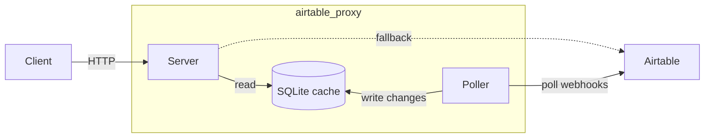

# airtable_proxy

This is intended to be a lightweight proxy for the Airtable API which trades data freshness for higher speeds. It uses [webhooks](https://airtable.com/developers/web/api/model/webhooks-payload) to tail all changes to a base's records and update a local cache. As a result, it is limited to certain operations.

## How it works

The poller subscribes to Airtable webhooks and tails change payloads into a local SQLite cache. The web server reads from that cache to serve client requests, and falls through to the Airtable API for anything it can't satisfy locally.



## Requirements

- Python 3.10 or newer
- An Airtable account with at least one base
- A hostname **you control**. It does not need to resolve yet, but Airtable will eventually POST webhook payloads to that URL — anyone who controls the domain controls your data.

## Install

```bash
git clone https://github.com/mesozoic/airtable_proxy
cd airtable_proxy
pip install -e .
```

## Get an Airtable personal access token

1. Visit https://airtable.com/create/tokens.
2. Create a token with these scopes:
   - `data.records:read`
   - `schema.bases:read`
   - `webhook:manage`
3. Grant the token access to each base you want to proxy.

Find your **base ID** in any Airtable URL: `https://airtable.com/appXXXXXXXXXXXXXX/tblYYYY...` — the `app...` segment is the base ID.

## Configure

Copy the example and edit it:

```bash
cp config.yaml.example config.yaml
```

```yaml
hostname: airtable-proxy.your.domain.name
storage:
    sqlite: data/airtable_proxy.db
bases:
    appCRvRn3LxhzqYUZ:
        api_key: env(AIRTABLE_API_KEY)
```

| Key | Purpose |
| --- | --- |
| `hostname` | The domain Airtable will POST webhook payloads to. Required. |
| `storage.sqlite` | Path to the SQLite cache file. Optional; defaults to `data/airtable_proxy.db`. |
| `bases` | Map of base ID → per-base config. Optional; if omitted, every request is proxied straight through to Airtable using the caller's bearer token. |
| `bases.<baseId>.api_key` | The PAT to use when polling this base. Use `env(VAR_NAME)` to read it from the environment instead of the file. |

## Run it

```bash
export AIRTABLE_API_KEY=patXXXXXXXXXXXXXX.secret
python -m airtable_proxy
```

This starts the API server on port 8000 and the poller in the same process. Both auto-discover `./config.yaml`. To use a different file, set `AIRTABLE_PROXY_CONFIG=/path/to/config.yaml` or pass the path as the only argument.

For finer control (separate processes, separate logs, independent restarts), run them apart:

```bash
python -m airtable_proxy.server   # API only
python -m airtable_proxy.poller   # poller only
```

In production, supervise these with whatever your platform provides — systemd, docker-compose, or a process manager.

## Verify it's working

The API answers a health check without authentication:

```bash
curl http://localhost:8000/health
# {"status":"ok"}
```

Then list records (replace `<baseId>` and `<TableNameOrId>` with values from your base):

```bash
curl -H "Authorization: Bearer $AIRTABLE_API_KEY" \
     http://localhost:8000/v0/<baseId>/<TableNameOrId>
```

The first request to a new bearer token verifies it against Airtable, then caches the hash. Subsequent requests are served from the local SQLite cache.

## Contributing

This project uses Poetry to manage dependencies:

```bash
poetry install
poetry run mypy --strict && poetry run pytest
poetry run pre-commit run
```

Integration tests hit the real Airtable API and need credentials; for example:

```bash
echo AIRTABLE_API_KEY=$AIRTABLE_API_KEY > .env.itest
poetry run dotenv -f .env.itest run -- pytest -k integration
```
