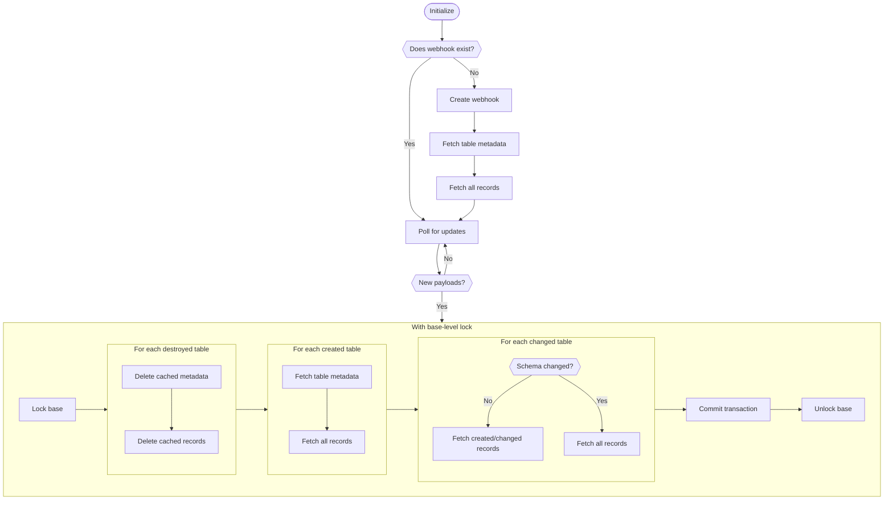

```mermaid

flowchart TD
    init([Initialize])
    init --> check_webhook

    check_webhook{{Does webhook exist?}}
    check_webhook -->|No| create_webhook
    check_webhook -->|Yes| poll

    create_webhook[Create webhook]
    --> load_m[Fetch table metadata]
    --> load_r[Fetch all records]
    --> poll[Poll for updates]
    --> payload?{{New payloads?}}
    payload? -->|No| poll
    payload? -->|Yes| locked

    subgraph locked [With base-level lock]
        lock[Lock base]
        --> dt
        --> nt
        --> ct
        --> commit[Commit transaction]
        --> unlock[Unlock base]

        subgraph dt [For each destroyed table]
            dtm[Delete cached metadata]
            -->
            dtr[Delete cached records]
        end

        subgraph nt [For each created table]
            ntm[Fetch table metadata]
            -->
            ntr[Fetch all records]
        end

        subgraph ct [For each changed table]
            ct_schema?{{Schema changed?}}
            ct_schema? -->|No| ctr
            ct_schema? -->|Yes| ctl

            ctr[Fetch created/changed records]
            ctl[Fetch all records]
        end
    end
```
